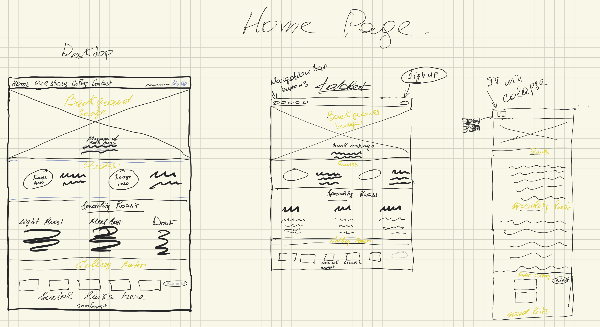
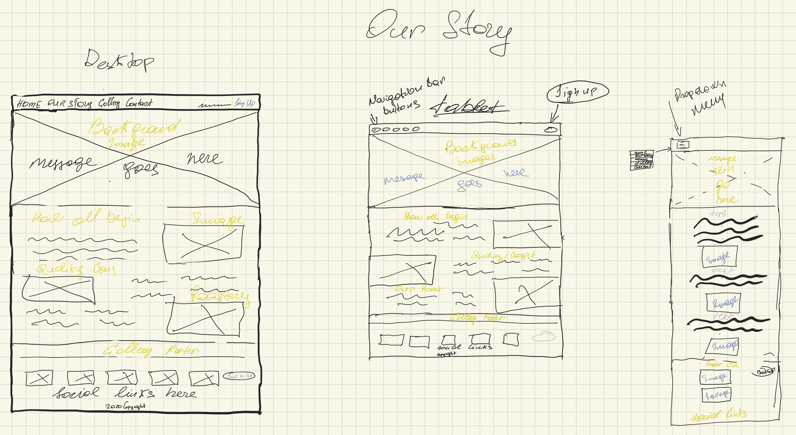
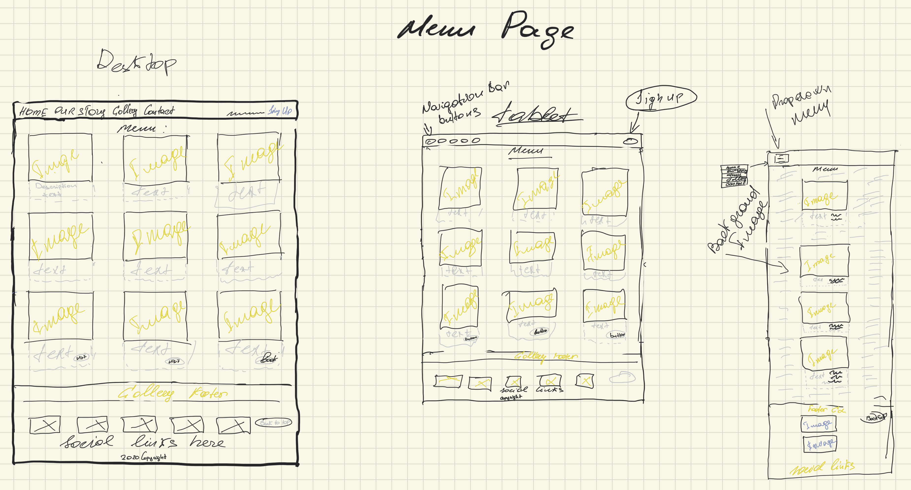
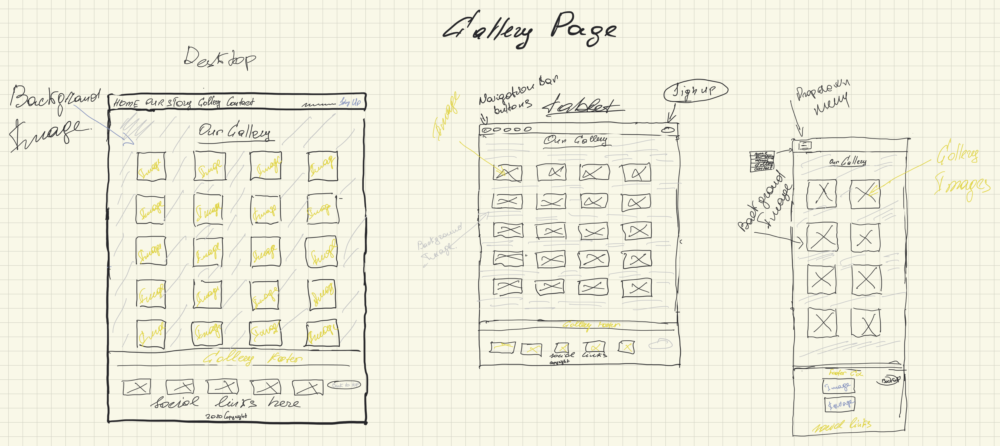
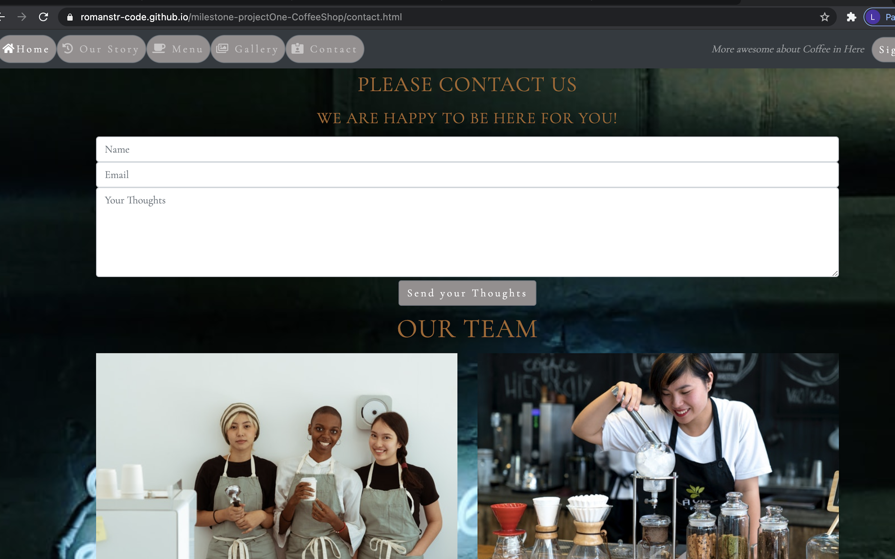

<h1 align="center">Milestone Project One CoffeeShop </h1>

[View My Milestone Project here.](https://romanstr-code.github.io/milestone-projectOne-CoffeeShop/)

<h2 align="center"> Code Institute / User-Centric Frontend Development. First milestone Project</h2>

This first milestone project we had the chance to impliment the knowledge we learn so far and to build a static website with minimum 3 pages.
I took the chance in building a 5 pages Coffee Shop website. In my mind, being a barista at the moment, this project should look very chill, informative in what kind of blends coffee house is using, the origins of the blends, what push and inspired the opening of this Coffee House.
Site have a menu page wich should display the best selling products with good images and informative information about the product. As well, a gallery page is required to show the amazing fresh, tasty and quality of the house products, (The gallery pictures I decided to be static).
On the last page, when a quest click the page he should feel that he is important for the house and will find a contact us form first, then scrolling down he will meet the team wich workes there.
Last thing, wanted the footer on 4 out of five pages to be similar and just on contact form to be different and to indicate the address, phone numbers, a google map and opening hours.
The place is designed for a small family business wich are in love with the magic of coffeine and the process of baking their own cakes as well a small their own Roastery.
The website is easy to navigate, so it is easy for customer to find his needs buy navigate from page to page, where he will encounter a well elaborated information, to locate, to call, find online presence and what he can enjoy buy visiting the place. 

# User Experience (UX)

-   ## User stories
   
-   ### First Time Visitor Goals

    1. As potential  quest,I want to know what this website is about.
    2. As potential quest, I want to have easy,positive and intuitive web browsing Experience.
    3. As potential  quest, I need to understand what kind of product they are selling, where are they and how to locate them as well as 
    reviews on social platform from quest wich already Experienced the place.
    4. As potential  quest, I want to know when I can use their services.
    5. As potential  quest, I want to know in what price range the business operates.

-   ### Returning Visitor Goals
     
     1. As decided quest, I want to know if the place has special offers / prices.
     2. As decided quest, I want to know if the place still have the same standards.
     3. As decided quest, I want to know if the opening hours still the same.
     4. As decided quest, I want to know if the place has a way of place a compliment / complain.
     5. As decided quest, I want to know if there are special events for customers.
     6. As decided quest, I want to understand the ordering process, so I know what steps I need to take.

-   ## Design

     -   #### Colour Scheme
     - The colors used in the project changes from page to page in most of the cases.
     - Most used colors are grey, white, light gold and gold.

-   ### Typography

     - The main font used in the project is Cormorant Garamond, with sans-serif as fallback, in case of any issue that may appear.
     - Cormorant Garamond, is a good fit font for a project like coffee shop , it looks clean and easy to read.

-   ### Imagery

    - I chose to place Images on all pages.
    - Images are important for a coffee house.
    - When you travel to the website you can see from the beginning how images point to place atmosphere.
    - All images have a task to point to strong parts of the coffee house and for eye catching.

<h1 align="center"></h1>

* ## Wireframes

<h1 align="center"></h1>
<h1 align="center"></h1>
<h1 align="center"></h1>
<h1 align="center"></h1>
<h1 align="center"></h1>

## Features 

  Each page of the site contains a responsive <strong>Navigation bar</strong> wich will be on the left side and will collapse in burger icon on mobile. 
 On the left side of the navigation bar you find a <strong>Sign Up</strong> button ,wich will be active just on big screens.
 All pages contain a <strong>Footer gallery</strong> with <strong>Social Links </strong> ,<strong>Copyright</strong>, and <strong>Back to Top</strong>button.
 The last page <strong>Footer</strong> is different then first 4 with information like : <em>Address</em>, <em>Contact Number</em>, <em>Working Hours</em> and <em>Google Map</em>.
 
 Every page has their won heros. The reason of that is simple, the website travelers should have a positive feeling on navigating on site and to catch their attention.

### Home Page 

When you land on <strong>Home Page </strong> you encounter a carousel with 3 images with site heros. Scrolling down you find first, the quotes from quests wich already are loyal to the place.
Going down the page you can see an interesting information about what kind of type of roast beans coffee house is using.
At the end of the page is a <em>Footer gallery</em> with <em>Social Links</em> and <em>Copyright</em> information. 
On <em>mobile phone</em> the page remain the same with exception of <em>navigation bar </em> ,<em> carousel messages.</em> and <em> footer gallery</em> shows just 4 vertical fotos. 
Reagarding the information on <strong> Home Page </strong> , the goal is for the visitors to have from beginning a strong and as maximum impact as possible.

### Our Story 

 <strong> Our Story</strong> page is, full with pictures and information about the business, how the ideea came to life, what the managing person cherish and try to mentain and finaly 
 a <em>Footer gallery</em> and a callout button <em>Back to Top</em> at the end of the page.
 On this page, the browsing person can find owner feelings about coffee and can relate to them.
 The structure of the page is simple,and important to not give person who's browsing headache.
 On <em>mobile phones</em> the page will change and all will appear in vertical position with paragraps on top and images on the bottom.

### Menu Page

<strong>Menu Page</strong> is one of the most important pages on the site. On this page can observe the best selling products of the house.
You find a album page, with a background image and 9 row cards, Each representing their own product, description and price.
To attract the eye of the quest, the last 3 rows is something even more special, uniq and exclusive for this place and contains <em>call to action buttons</em>.
<em>Footer</em> remain exactly the same as on previous pages.
On Tablet devices the page remains the same, but <em>footer gallery</em> changes, is displaying all fotos vertical.
On Ipad Pro though, the page remains as on bigger size screens.
<em>Mobile</em> devices get a vertical page, with fotos on top and information under.

### Gallery Page

<strong> Gallery Page</strong> 
<em> Gallery Page</em> displays album division, with columns thumbnail images and a bright background foto.
The thumbnail images on all screens appear as square and each thumbnail images represents coffe house, it's quests and products.
If we go down the road of screens to a Tablet (beside IpadPro), you will find on medium screens first and last col, will display foto horizontal on the center,in between them, the rest columns emigrate in two vertical positions.
On mobile phones all gallery thumbnail images appear in 6 columns, wich makes fotos to emigrate in a vertical position.
Last, the <em>Footer gallery</em>, reamins the same as on las pages. 

 <strong><em>NOTE: On all devices fotos would appear as static.</em></strong> 

### Contact Us Page

<strong>Contact Us Page</strong> contains at the top of the page and centerd a contact us form. The form is asking for name,email,the quest / client thoughts and <em>Send Your Thoughts</em>button.
Under the contact form we have a container division, with 2 rows, wich display 6 large columns and 6 medium columns.On the first row second division, on the small devices to be blocked and inline.
On the second row both small collumn to be blocked and inline.
At last we have the <em>Footer</em>. We have a division wich contains 4 buttons that are linked with 4 pages from website.
Under the links we have a <em>Footer</em> paragraph wich indicates the details of business, such as phone and address.
On the right side of paragraph it's displayed Working hours. Beside that you can find a Google map exactly under paragraph.
On <em>Tablet</em> devices all information stays exactly the same as on bigger screens.
<em>Mobile</em> phones, get a sweet change.All information collapse in a vertical position, and from top to bottom, from Contact Form to fotos, and footer is a long nice scrolling Experience.

## Features That Exist

- Navigation Bar - You can find [NavigationBar](https://romanstr-code.github.io/milestone-projectOne-CoffeeShop/) on Every page wich alows users to navigate troughout the site and now for sure where are they.
- Call to action Buttons - You can [easy](https://romanstr-code.github.io/milestone-projectOne-CoffeeShop/) locate them buy browsing the site. They display different actions from page to page.
- Copyright reserved - On every [Page](https://romanstr-code.github.io/milestone-projectOne-CoffeeShop/) on the <strong> Footer</strong> you can find the Copyright.
- Social Links - On every [Page](https://romanstr-code.github.io/milestone-projectOne-CoffeeShop/) on the <strong>Footer</strong> you can locate easy all social links.
- Contact Form - On <Strong><em>Contact Us</em></strong> [Page](https://romanstr-code.github.io/milestone-projectOne-CoffeeShop/) is situated the contact form and is placed very visible for traveler eye.

## Technologies Used

-  ## Languages Used

- [HTML5](https://developer.mozilla.org/en-US/docs/Web/Guide/HTML/HTML5)  
- [CSS](https://developer.mozilla.org/en-US/docs/Web/CSS) 

- ### Frameworks, Libraries & Programs Used

- [Bootstrap 4.0.0:](https://getbootstrap.com/) 
  i.Use Bootstrap to simplify the structure of the website and make the website responsive.
- [jQuery](https://jquery.com/) 
  i.jQuery came with Bootstrap to make the navbar responsive.
- [GoogleFonts](https://fonts.google.com/) 
  i.The project uses google fonts to style website fonts.
- [Font Awesome](https://fontawesome.com/) 
  i.The project uses fontawesome for adding icons and design purpose.
- [Git](https://git-scm.com/)
  i.The Project used Git  for version control by utilizing the Gitpod terminal to commit to Git and Push to GitHub.
- [GitHub:](https://github.com/)
  i.ThIs project use GitHub, for the purpose of storing the code after this one was pushed from Git.
- [iMockup](https://apps.apple.com/us/app/imockups-for-ipad/id364885913)
  i.The project uses an Apple app called iMocup for the reason of creating Wireframes .

## Testing
- For testing were used Css Validation Service and Markup Validation Service.Reason is to  check the validity of the website code.

 - [CSS Validation Service](https://jigsaw.w3.org/css-validator/#validate_by_uri) 
 - [Markup Validation Service](https://validator.w3.org/)

### Results of Testing

 - [Home Results](https://github.com/romanstr-code/milestone-projectOne-CoffeeShop/tree/master/TestingResults)
 - [Oustory Results](https://github.com/romanstr-code/milestone-projectOne-CoffeeShop/tree/master/TestingResults)
 - [Menu Results](https://github.com/romanstr-code/milestone-projectOne-CoffeeShop/tree/master/TestingResults)
 - [Gallery Results](https://github.com/romanstr-code/milestone-projectOne-CoffeeShop/tree/master/TestingResults)
 - [Contact Results](https://github.com/romanstr-code/milestone-projectOne-CoffeeShop/tree/master/TestingResults)

### Testing User Stories from User Experience (UX) Section

-   #### First Time Visitor Goal
<h1 align="center"></h1>

 1. * Being a first time visitor to the page I want easy to understand the purpose off the site I'm browsing.
 - * First thing what website quest will encounter when visiting the site is cleanleness of navigation bar and how smoth it is.
 - * Second I will notice the hero image and then quotes from social media wich will make me more attracted to stay and find out more about the place.
 - * Third, I will encounter a well formed message about house speciality's blends.
 - * Arriving to the footer I will find a foto gallery, social links and a back to top button.
 2. * As First time visitor, and a coffee lover I would like to know more about the place history.
 - * At the bottom of the first page, is back to top button, after click on it will take us on journey back to top of the page and will find easy the second page wich will be our story.
 - * On our story I will encounter a nice background foto with a short message about history of our love for coffee.
 - * Continuing my journey down the page I will find nicely formed message when we open with a nice foto meeting me.Here I will find out all about the place .

-    #### Returning Visitor Goals
<h1 align="center"></h1>

 3. * As a potential visitor I would like to know what range of products and beverage does the place have.
 - * So by clicking on menu button, we will go to a colorful page, with all kinds of best seller product.
 - *  Now I want to know more so I start to read the information providing on each product and check their price.
 4. * In a position of potential client I would like to know  more about the quality of the products and maybe some reviews.
 - * So I will find of course the social links wich are situated on each page on the footer.
 - * Buy clicking on social links I will have the opportunity to check what their quests are thinking about them.

 -   #### Frequent User Goals

5. * As a convienced customer , I want to know if there are new promitions , special prices on the site.
 - * The traveler will already be comfortable using the site and with zero efort will find out in the , about us page there are a callout button for visiting the Roastery.
 - * Also I will check the menu page, and will find the special prices of the day.
 - * Buy goind to the end of the page I will find the <em>Sunday Experience</em> day and special house blend.

<h1 align="center"></h1>

 6. * As a convienced and already decided customer I will like to know more information then it is displayed on site.
 - * So buy traveling to <Strong> contact us </strong> page, I will encounter the contact us form with a helpful meeting message.
 - * Also I can find buy scrolling down the contact page, on the footer the Phone number if I will decide to call the coffee house.
 - * Being on the footer teritory, and being convienced of my interest for the business I can easily access the social media links and subscribe for more of the coffee house News.

### Further Testing

- * The Project was tested on a series of browsers:
- * [Google Chrome](https://www.google.com/chrome/)
- * [Microsoft Edge](https://www.microsoft.com/en-us/edge)
- * [Safari Browsers](https://www.apple.com/safari/)
-  #### Viewed on different devices :
- * Laptop
- * Iphone X
- * Iphone X max
- * Iphone 7 plus

- #### I send my project to different people to check it and to point the mistakes wich I miss.
 * A good amount of time it took to check pages links were correctly done.
 * Carousel to work proper.
 * Proper use of buttons.
 * For album division cards to be responsive on all devices and the alerts to be visible.
 * On small devices for NavigationBar to collapse correctly and the links between pages to work good.

### Known Bugs

#### On Tablet
-  On some Tablets the Home page, jumbotron carousel messages is hard to read.
-  On some Tablets on menu page, the last divisions with buttons, one button going out from card body and interact with next card button.
#### On Desktop
- In some browsers the social links is not opening.

## Deployment

### GitHub Pages

#### This Project was developed with [Gitpod](https://www.gitpod.io/) and was Pushed to [GitHub](https://github.com).
- 1. Open <strong>GitHub</strong> site.
- 2. Log In into Your account
- 3. Navigate to your Repository
- 4. Pick Project Repository
- 5. On the right side , click on Settings
- 6. Scroll to GitHub Pages
- 7. Click the <em>None</em> or <em>Branch</em> drop-down menu and select a publishing source.
- 8. Use the drop-down menu to select a folder for your publishing source.
- 9. Click Save 

### Forking the GitHub Repository
- * With forking we can produce a personal copy of someone else's project.So We can make changes to the project without affecting the original Project.
- 1. Log In to GitHub
- 2. Locate the Repository 
- 3. On top right side click On Fork button.
- 4. Now You have a copy of Repository

### Making a Local Clone

# Credits

### Code
- On the first page carousel code came from  [W3schools](https://www.w3schools.com/bootstrap/bootstrap_carousel.asp)
- Sign Up Form came from Code Institute project [Whiskey Drop](https://romanstr-code.github.io/whiskey-drop/).
- Gallery footer came from [Mdbootstrap](https://mdbootstrap.com/docs/jquery/navigation/footer/)
- Image thumbnail came from [StartBootstrap](https://startbootstrap.com/snippets/thumbnail-gallery)
- Contact Us Form came from Code Institute project made with teacher [Resume](https://romanstr-code.github.io/resume-project-/)
- The Google map for last page footer I imported from [Mdbootstrap](https://mdbootstrap.com/docs/jquery/javascript/google-maps/)
- [Bootstrap4](https://getbootstrap.com/docs/4.0/getting-started/download/) was used for the entire project, in purpose of responsives and grid sistem.
- 
### Content
- Foto used in the project were used from a free stock videos and foto site [Pexels](https://www.pexels.com/)
- Foto were used as well from [Unsplash](https://unsplash.com/)
- Speciality blend division Content were copied from [Wikipedia](https://en.wikipedia.org/wiki/Main_Page)
- All the rest Content of the project was wrriten buy me. 

### Acknowledgements

- ## My Mentor
- I want to thank my mentor for the positivity during the project process.From first call, to last call he encourage
me. We talked about my idea at first call, and he already had good amount of profesional guidance how should the project look like.
Truly energetic and open for help at any point of project process.
He was very optimistic and open for all my quastions, so by doing that he indirectly push me to not stop working and belive that I can Truly can finish the project.
He helped me very much and I would like to thank him for that.

<strong><em>NOTE: I would recomend Gerry Mcbride like mentor for future students.</em></strong>

P.P.S For future students who may or may not read this message. When the moment came and you think that you are not good for this and want to give up, remember have patience,believe in yourself and keep going,everything will be ok, just Do not give up.
